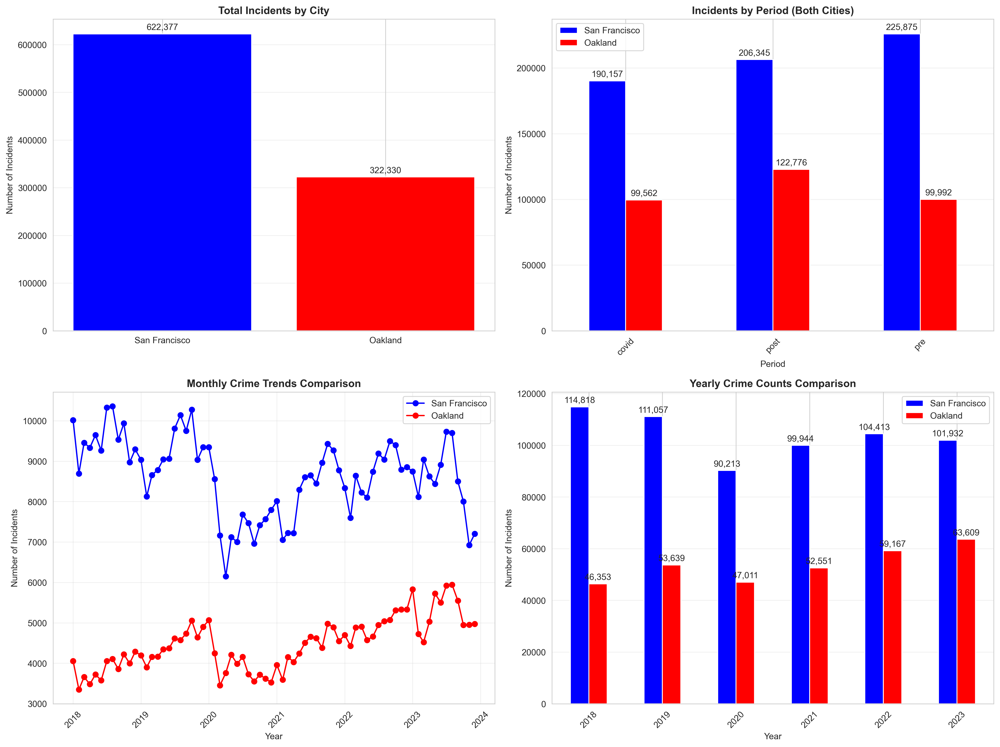
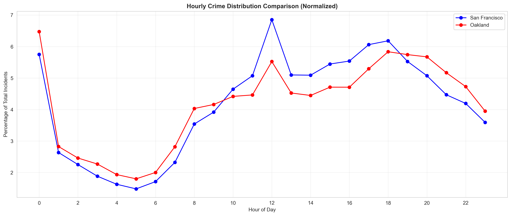
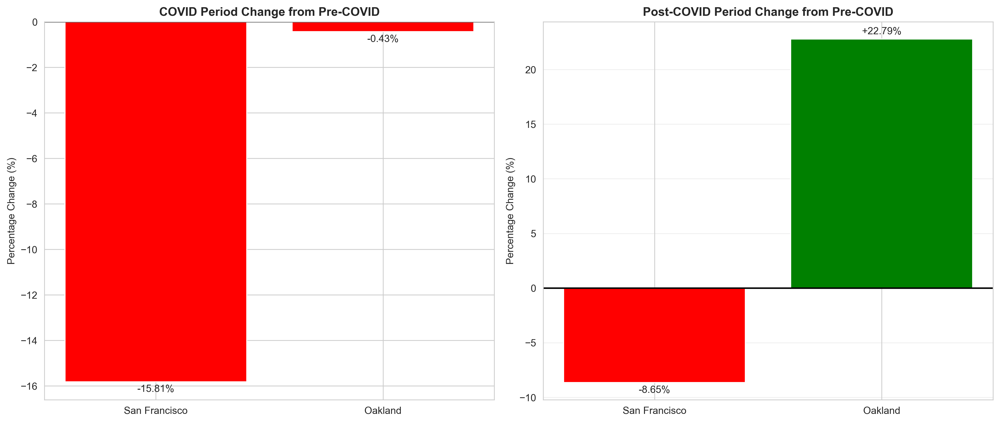

# Bay Area Crime Data Analysis Project: San Francisco vs Oakland

## Project Overview

This data analysis project examines crime trends in two major Bay Area cities, SF and Oakland, focusing on the impact of the COVID-19 pandemic on crime rates. The analysis compares crime patterns across three distinct periods: pre-COVID (before March 2020), COVID (March 2020 - December 2021), and post-COVID (2022 onwards).

## Data Sources

- **San Francisco**: [San Francisco Open Data](data.sfgov.org)
- **Oakland**: [Oakland Open Data](data.oaklandca.gov)

Raw data was collected through web scraping and API access, then cleaned and standardized for analysis.

## Matplotlib Visualizations

### City Comparison



### Hourly Patterns



### Period Impact



## How to Run

1. **Setup Environment:**

   ```bash
   python -m venv .venv
   source .venv/bin/activate
   pip install -r requirements.txt
   ```

2. **Run Analysis:**

   ```bash
   python scripts/analyze_combined.py
   ```
